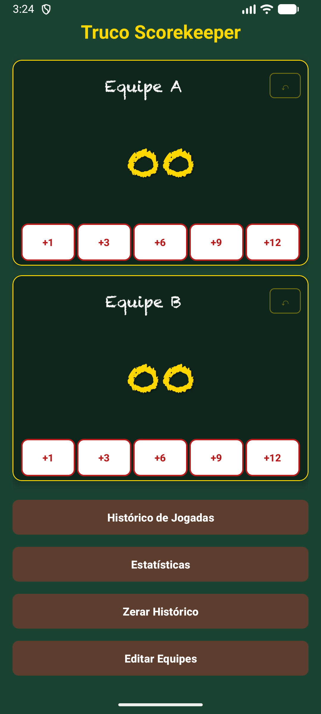
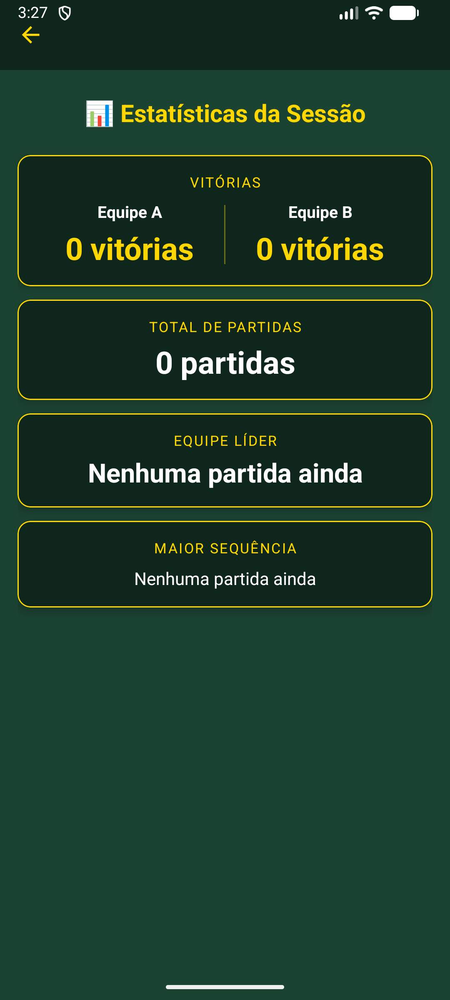
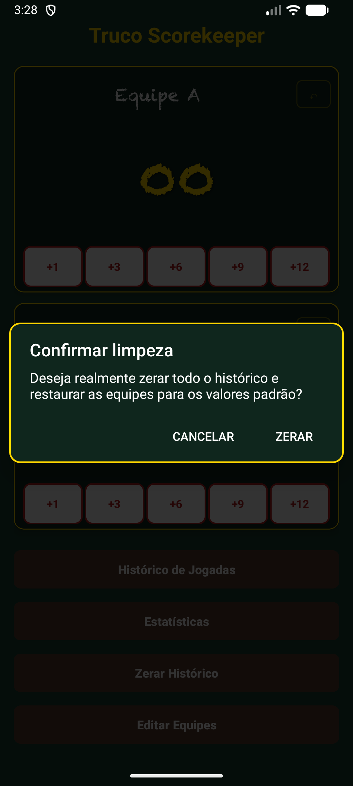

# Truco Scorekeeper 🃏

Aplicativo Android para controle de pontuação em partidas de Truco Mineiro — desenvolvido em Kotlin com Android Views.

---

## Sobre o Projeto

Trabalho final da disciplina **Android Básico** da Pós-Graduação em Programação para Dispositivos Móveis da **UTFPR**.

O objetivo é oferecer uma forma simples e intuitiva de controlar partidas de Truco: registrar pontos, desfazer jogadas, acompanhar o histórico de vitórias, consultar estatísticas da sessão e personalizar os nomes das equipes — tudo em uma interface temática inspirada nas mesas de feltro verde do Truco Mineiro.

---

## ✨ Diferenciais

- Interface inspirada no Truco Mineiro
- Material Design 3
- Efeitos sonoros personalizados
- Histórico de partidas
- Estatísticas de vitórias
- Desfazer jogadas por equipe
- Personalização de equipes
- Adaptive Icon autoral inspirado em Minas Gerais
- Internacionalização utilizando resources Android
- ViewBinding em todas as telas

---

## Capturas de Tela

### Launcher


### Tela Principal



### Personalização das Equipes


### Histórico de Partidas


### Estatísticas da Sessão



### Limpeza do Histórico



---

## 🎨 Identidade Visual


O ícone foi projetado para refletir a identidade cultural do Truco Mineiro:

- **Feltro verde** — referência direta à mesa de baralho, presente em todas as rodas de truco
- **Triângulo vermelho** — inspirado na bandeira de Minas Gerais e no Triângulo Mineiro, região com forte tradição no jogo
- **Naipe de paus (♣)** — representa o Zap, a maior carta do Truco Mineiro, sinônimo de jogada decisiva

O ícone é implementado como **Adaptive Icon** (API 26+), adaptando-se a qualquer forma de launcher — quadrado, arredondado, squircle ou circular.

### Estudo do Ícone


---

## Funcionalidades

- Controle de pontuação individual (+1, +3, +6, +9 e +12)
- Desfazer última jogada por equipe
- Validação automática de vitória ao atingir 12 pontos
- Efeitos sonoros temáticos em cada ação
- Histórico de partidas ganhas por cada equipe
- Estatísticas da sessão: vitórias, total de partidas, equipe líder e maior sequência
- Personalização dos nomes das equipes
- Reinicialização completa do histórico com confirmação
- Interface temática inspirada em mesas de truco

---

## Tecnologias Utilizadas

| Tecnologia | Uso |
|---|---|
| Kotlin | Linguagem principal |
| Android SDK | Plataforma de desenvolvimento |
| Material Design 3 | Componentes visuais (MaterialCardView, MaterialToolbar, TextInputLayout) |
| ViewBinding | Acesso seguro às views em todas as telas |
| Activity Result API | Retorno de dados entre Activities |
| MediaPlayer | Efeitos sonoros temáticos |
| ConstraintLayout | Layout responsivo |
| Adaptive Icons | Ícone adaptativo para diferentes launchers |
| Android Resources | Strings, Plurals e Drawables com suporte à internacionalização |

---

## Estrutura do Projeto

```
truco-scorekeeper/
├── app/src/main/
│   ├── AndroidManifest.xml
│   ├── java/com/example/trucoscorekeeper/
│   │   ├── MainActivity.kt           # Tela principal: placar e botões de pontuação
│   │   ├── HistoricoActivity.kt      # Exibe partidas ganhas por cada equipe
│   │   ├── EstatisticasActivity.kt   # Estatísticas da sessão
│   │   ├── NomesActivity.kt          # Personalização dos nomes das equipes
│   │   └── Jogada.kt                 # Data class para controle de desfazer por equipe
│   └── res/
│       ├── drawable/                 # botao_carta.xml, dialog_background.xml, ic_launcher_*.xml
│       ├── font/                     # chalkduster.ttf
│       ├── layout/                   # activity_main, historico, estatisticas, nomes
│       ├── mipmap-anydpi-v26/        # Adaptive Icon (API 26+)
│       ├── raw/                      # card_slap.mp3, swoosh.mp3, chora_fregues.mp3
│       └── values/                   # colors.xml, strings.xml, themes.xml, plurals.xml
├── docs/images/                      # Capturas de tela e identidade visual
├── build.gradle
└── settings.gradle
```

---

## Como Executar

1. Clonar o repositório
   ```bash
   git clone https://github.com/jeancarlosaps/truco-scorekeeper.git
   ```
2. Abrir no **Android Studio**
3. Sincronizar o Gradle
4. Executar em emulador ou dispositivo físico (Android 7.0+)

---

## Autor

**Jean Carlos Pereira**

Desenvolvedor Mobile

[](https://github.com/jeancarlosaps)
