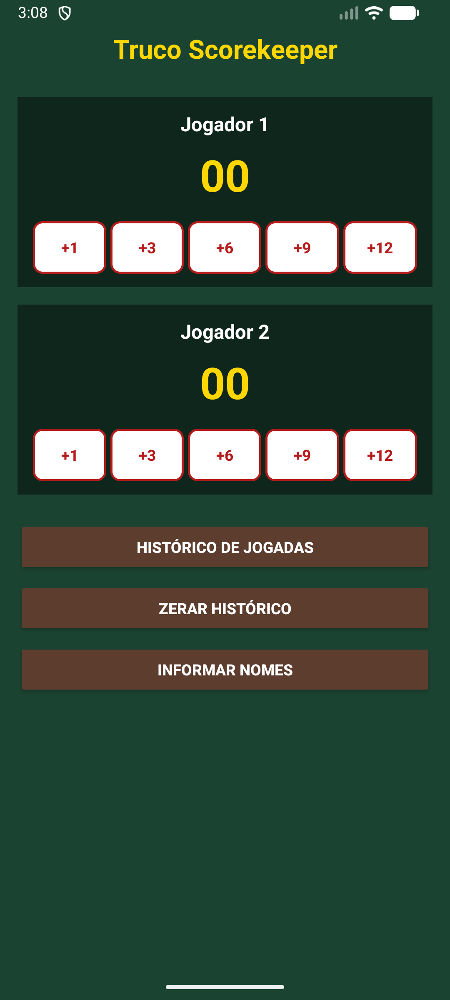
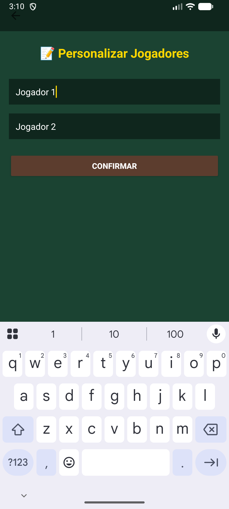
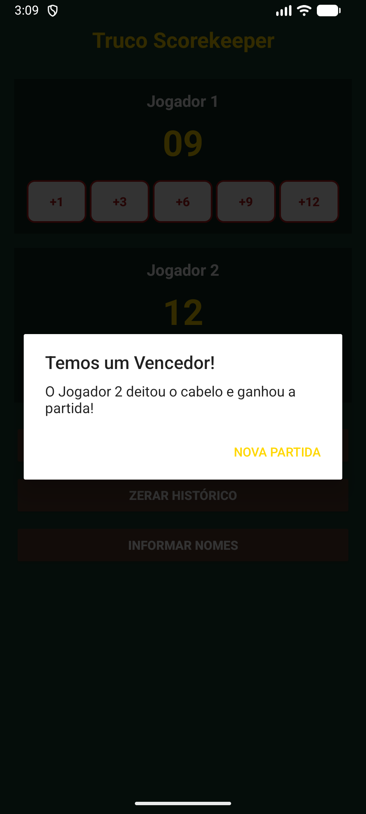

# Truco Scorekeeper 🃏

Aplicativo Android para controle de pontuação em partidas de Truco — desenvolvido em Kotlin com Android Views.

---

## Sobre o Projeto

Trabalho final da disciplina **Android Básico** da Pós-Graduação em Programação para Dispositivos Móveis da **UTFPR**.

O objetivo é oferecer uma forma simples e intuitiva de controlar partidas de Truco: registrar pontos, acompanhar o histórico de vitórias e personalizar os nomes dos jogadores, tudo em uma interface temática inspirada nas mesas de feltro verde.

---

## Funcionalidades

- Controle de pontuação individual (+1, +3, +6, +9 e +12)
- Validação automática de vitória ao atingir 12 pontos
- Histórico de partidas ganhas por cada jogador
- Personalização dos nomes dos jogadores
- Reinicialização completa do histórico
- Interface temática inspirada em mesas de truco

---

## Tecnologias Utilizadas

| Tecnologia | Uso |
|---|---|
| Kotlin | Linguagem principal |
| Android Views | Interface declarativa em XML |
| ViewBinding | Acesso seguro às views |
| ConstraintLayout | Layout responsivo |
| Intent | Navegação entre telas |
| Activity Result API | Retorno de dados entre Activities |
| Material Design | Componentes visuais |

---

## Capturas de Tela

### Tela Principal



### Histórico de Partidas


### Personalização dos Jogadores



### Vitória Detectada



---

## Estrutura do Projeto

```
truco-scorekeeper/
├── app/src/main/
│   ├── java/com/example/trucoscorekeeper/
│   │   ├── MainActivity.kt         # Tela principal: placar e botões de pontuação
│   │   ├── HistoricoActivity.kt    # Exibe partidas ganhas por cada jogador
│   │   └── NomesActivity.kt        # Personalização dos nomes dos jogadores
│   └── res/
│       ├── drawable/               # botao_carta.xml (estilo dos botões de ponto)
│       ├── layout/                 # activity_main, activity_historico, activity_nomes
│       └── values/                 # colors, strings, themes, plurals
├── docs/images/                    # Capturas de tela
├── build.gradle
└── settings.gradle
```

---

## Como Executar

1. Clonar o repositório
   ```bash
   git clone https://github.com/jeancarlosaps/truco-scorekeeper.git
   ```
2. Abrir no **Android Studio**
3. Sincronizar o Gradle
4. Executar em emulador ou dispositivo físico (Android 7.0+)

---

## Autor

**Jean Carlos Pereira**

Desenvolvedor Mobile

[](https://github.com/jeancarlosaps)
